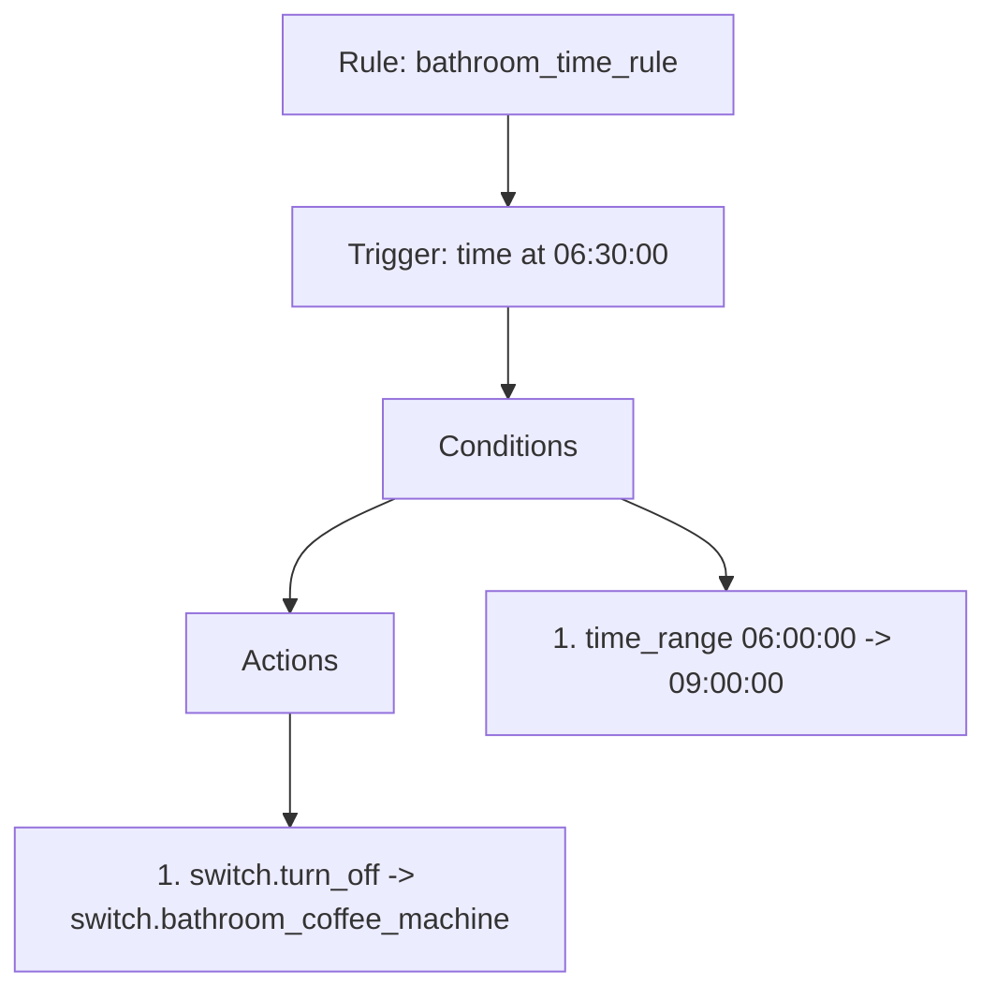
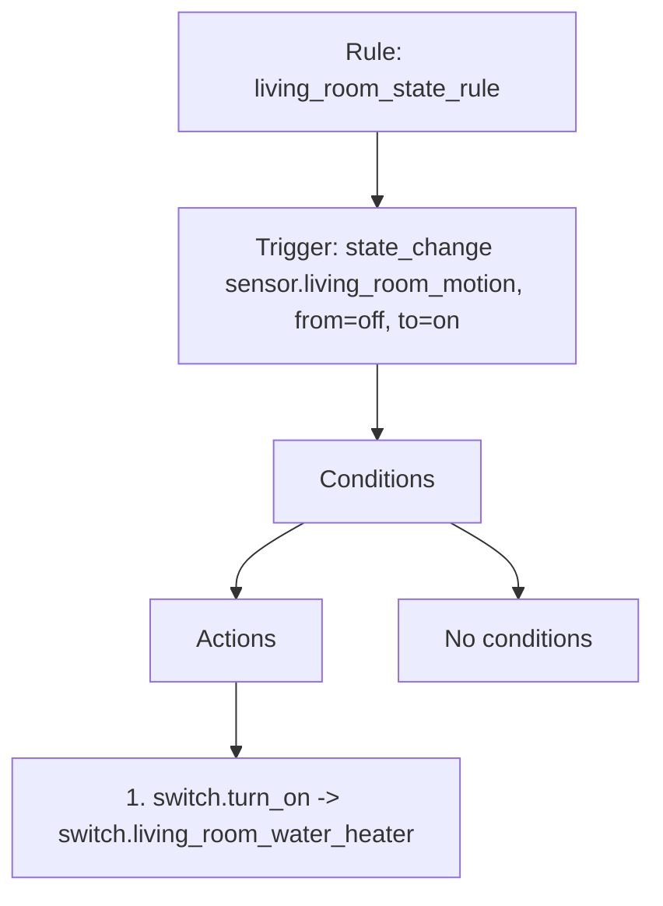
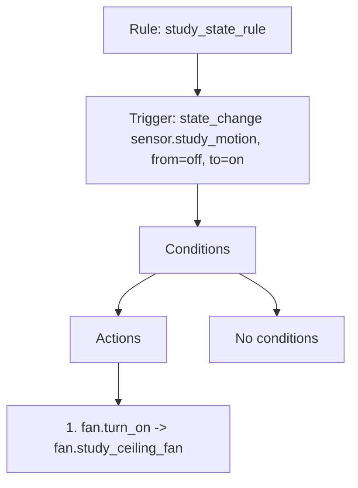
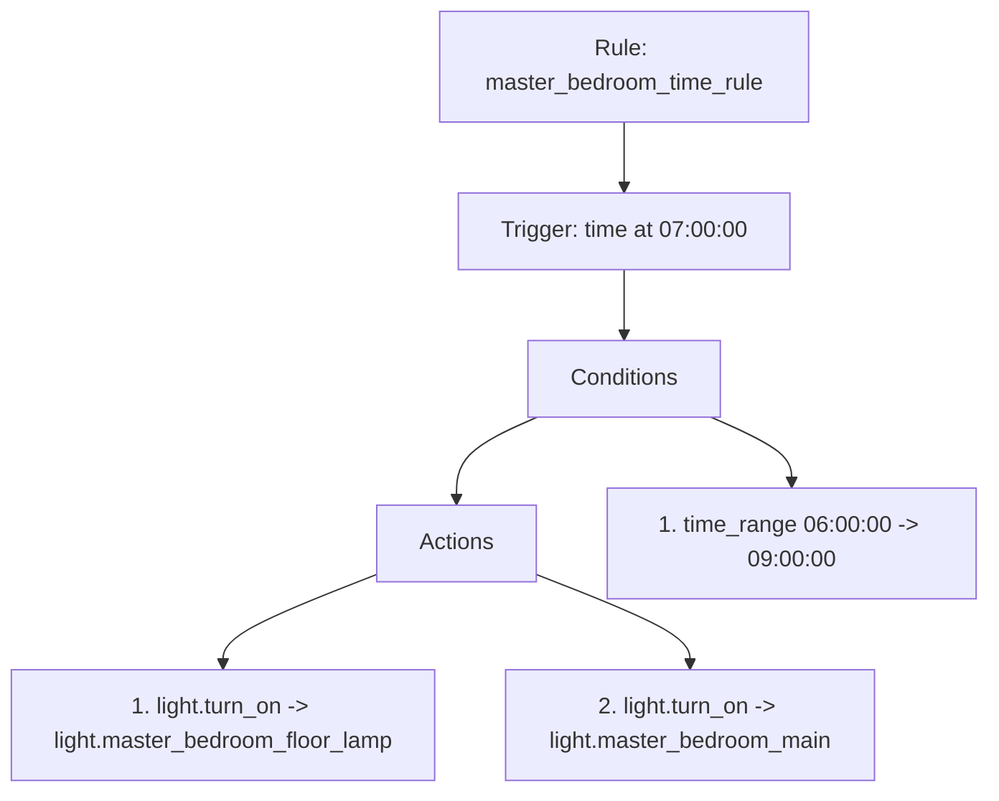
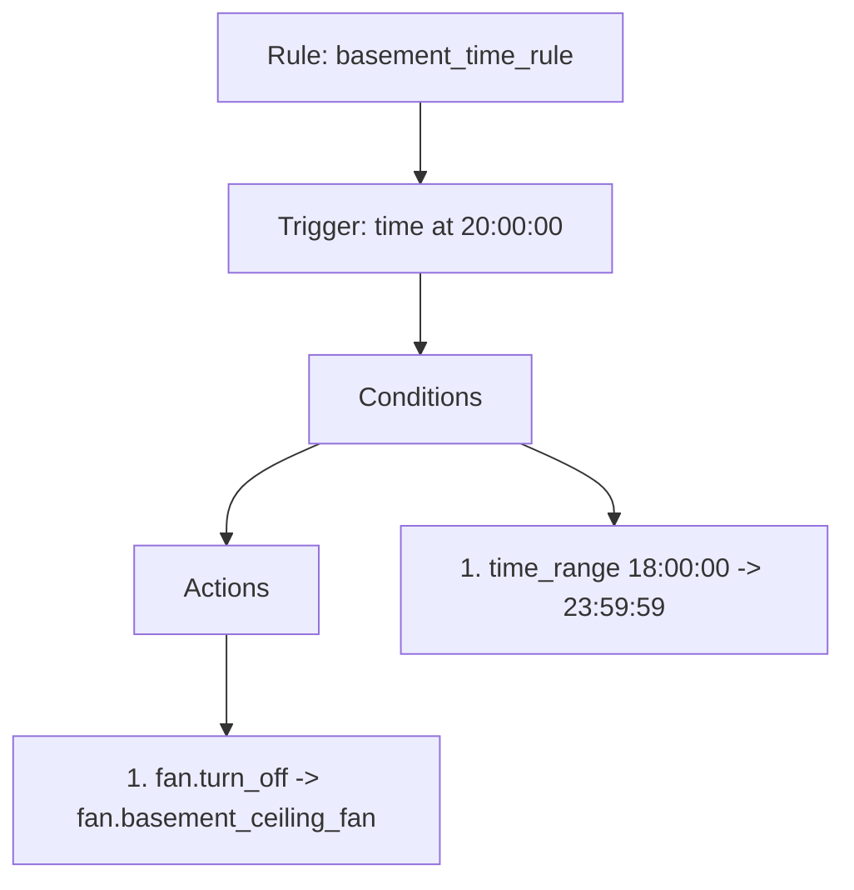

# 规则解释与可视化有效性实验报告

## 实验目标

在不做真人用户实验的前提下，验证加入中文解释与结构化可视化后，规则是否更容易被程序层面展示和理解。

## 示例样本（共 5 条）

### 样本 1: bathroom_time_rule

**原始 YAML**

```yaml
alias: bathroom_time_rule
trigger:
- platform: time
  at: 06:30:00
condition:
- condition: time
  after: 06:00:00
  before: 09:00:00
action:
- service: switch.turn_off
  target:
    entity_id: switch.bathroom_coffee_machine
mode: single
```

**中文解释**

规则“bathroom_time_rule”：在每天 06:30:00 触发；条件为：时间处于 06:00:00 到 09:00:00 之间；执行动作：调用 switch.turn_off 操作 switch.bathroom_coffee_machine；执行方式为单次执行模式。

**Mermaid 结构图**



### 样本 2: living_room_state_rule

**原始 YAML**

```yaml
alias: living_room_state_rule
trigger:
- platform: state
  entity_id: sensor.living_room_motion
  from: 'off'
  to: 'on'
condition: []
action:
- service: switch.turn_on
  target:
    entity_id: switch.living_room_water_heater
mode: single
```

**中文解释**

规则“living_room_state_rule”：当 sensor.living_room_motion 状态变化时触发，原状态为 off，目标状态为 on；无额外条件；执行动作：调用 switch.turn_on 操作 switch.living_room_water_heater；执行方式为单次执行模式。

**Mermaid 结构图**



### 样本 3: study_state_rule

**原始 YAML**

```yaml
alias: study_state_rule
trigger:
- platform: state
  entity_id: sensor.study_motion
  from: 'off'
  to: 'on'
condition: []
action:
- service: fan.turn_on
  target:
    entity_id: fan.study_ceiling_fan
mode: single
```

**中文解释**

规则“study_state_rule”：当 sensor.study_motion 状态变化时触发，原状态为 off，目标状态为 on；无额外条件；执行动作：调用 fan.turn_on 操作 fan.study_ceiling_fan；执行方式为单次执行模式。

**Mermaid 结构图**



### 样本 4: master_bedroom_time_rule

**原始 YAML**

```yaml
alias: master_bedroom_time_rule
trigger:
- platform: time
  at: 07:00:00
condition:
- condition: time
  after: 06:00:00
  before: 09:00:00
action:
- service: light.turn_on
  target:
    entity_id: light.master_bedroom_floor_lamp
- service: light.turn_on
  target:
    entity_id: light.master_bedroom_main
mode: single
```

**中文解释**

规则“master_bedroom_time_rule”：在每天 07:00:00 触发；条件为：时间处于 06:00:00 到 09:00:00 之间；执行动作：调用 light.turn_on 操作 light.master_bedroom_floor_lamp；调用 light.turn_on 操作 light.master_bedroom_main；执行方式为单次执行模式。

**Mermaid 结构图**



### 样本 5: basement_time_rule

**原始 YAML**

```yaml
alias: basement_time_rule
trigger:
- platform: time
  at: '20:00:00'
condition:
- condition: time
  after: '18:00:00'
  before: '23:59:59'
action:
- service: fan.turn_off
  target:
    entity_id: fan.basement_ceiling_fan
mode: single
```

**中文解释**

规则“basement_time_rule”：在每天 20:00:00 触发；条件为：时间处于 18:00:00 到 23:59:59 之间；执行动作：调用 fan.turn_off 操作 fan.basement_ceiling_fan；执行方式为单次执行模式。

**Mermaid 结构图**



## 自动总结：解释层增加的可读信息

- 解释层显式补充了规则名称、触发方式、条件语义和动作语义，降低了直接阅读 YAML 的结构门槛。
- 中文解释将字段级信息转成句子级语义，适合快速检查规则是否符合原意。
- Mermaid 结构图把 Trigger、Conditions、Actions 的执行链条显式展开，便于定位规则的决策路径。
- 相比只看 YAML，解释与图结构更容易发现缺失条件、冲突动作和过于复杂的规则结构。

## 结论模板

> 从程序层面的展示结果看，中文解释能够把规则的结构字段转化为更容易直接理解的自然语言描述，而 Mermaid 结构图则进一步揭示了触发、条件和动作之间的执行关系。因此，解释层与可视化层虽然不直接改变规则生成结果，但显著提升了规则的可读性、可检查性和展示友好性。
