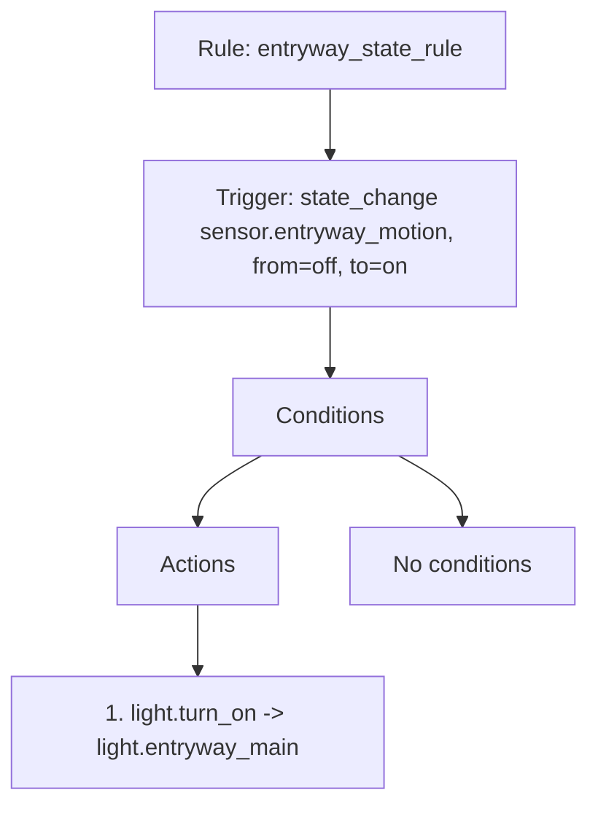

```mermaid
flowchart TD
    RULE["Rule: entryway_state_rule"]
    TRIGGER["Trigger: state_change sensor.entryway_motion, from=off, to=on"]
    CONDITIONS["Conditions"]
    ACTIONS["Actions"]
    RULE --> TRIGGER
    TRIGGER --> CONDITIONS
    CONDITIONS --> ACTIONS
    C0["No conditions"]
    CONDITIONS --> C0
    A1["1. light.turn_on -> light.entryway_main"]
    ACTIONS --> A1
```
