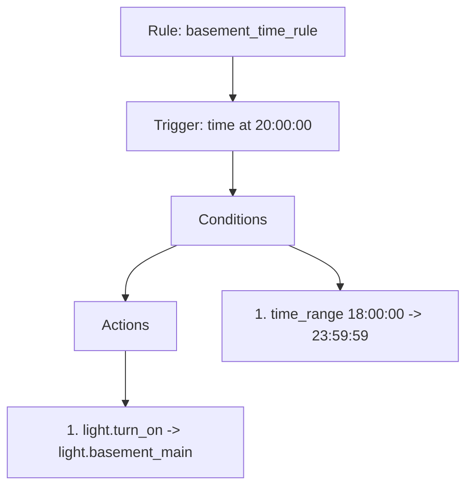

```mermaid
flowchart TD
    RULE["Rule: basement_time_rule"]
    TRIGGER["Trigger: time at 20:00:00"]
    CONDITIONS["Conditions"]
    ACTIONS["Actions"]
    RULE --> TRIGGER
    TRIGGER --> CONDITIONS
    CONDITIONS --> ACTIONS
    C1["1. time_range 18:00:00 -> 23:59:59"]
    CONDITIONS --> C1
    A1["1. light.turn_on -> light.basement_main"]
    ACTIONS --> A1
```
