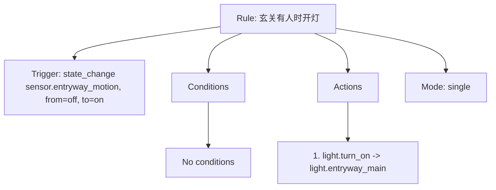

```mermaid
flowchart TB
    RULE["Rule: 玄关有人时开灯"]
    TRIGGER["Trigger: state_change sensor.entryway_motion, from=off, to=on"]
    CONDITIONS["Conditions"]
    ACTIONS["Actions"]
    MODE["Mode: single"]
    RULE --> TRIGGER
    RULE --> CONDITIONS
    RULE --> ACTIONS
    RULE --> MODE
    C0["No conditions"]
    CONDITIONS --> C0
    A1["1. light.turn_on -> light.entryway_main"]
    ACTIONS --> A1
```
